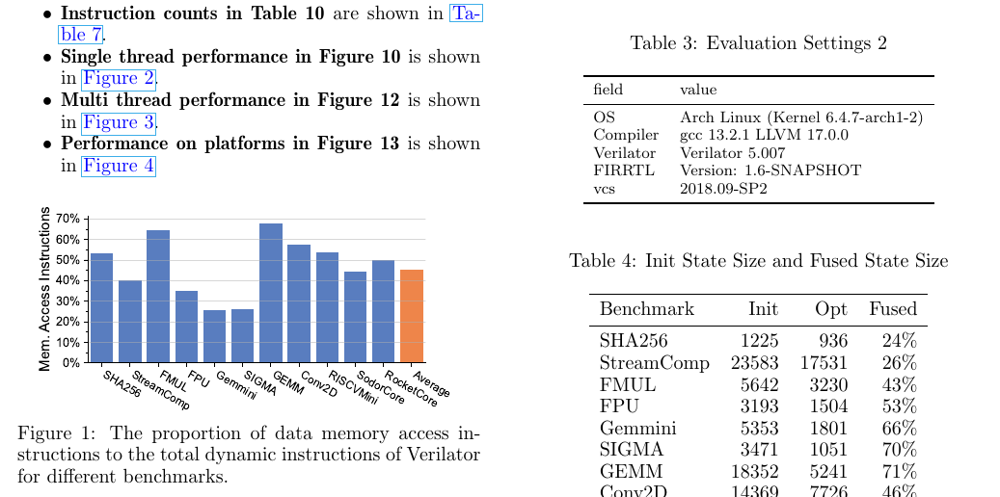

# Artifact Evaluation of Khronos

The evaluation will be run on 3 different machines, `base`, `plat-1`, and `plat-2`.
`base` is the "master" machine, and the other two are "slave" machines.

# Setup

## System Requirements

Install experiments requirements on all machines,
*if you are using our offered computer for artifacts, all the requirements have been installed.*

```bash
pacman -S wget rsync \
  jre11-openjdk-headless sbt \
  base-devel clang llvm \
  python3 python-pip python-numpy python-scipy python-pandas \
  python-matplotlib python-seaborn python-tqdm \
  cmake ninja boost ccache \
  flex bison help2man perf
```

Install pdf build dependencies on `base`:

```bash
pacman -S texlive # select all groups in texlive
pacman -S python-jinja # to generate latex table
```

Sometimes language may break the auto scripts, use the following command to reset language before evaluation:

```bash
unset LC_ALL LANG LANGUAGE
```

## SSH Setup

The platform names are shown in `env.sh`.
Configure `~/.ssh/config`, `~/.ssh/authorized_keys` correctly to make sure no password is needed for ssh **on each machine**, i.e. the following command should not require password or throw errors.

```bash
ssh base true   # no password is needed
ssh plat-1 true # no password is needed
ssh plat-2 true # no password is needed
```

*Note: Make sure `base` can ssh itself.*

# Evaluation

Clone this repo to the **`$HOME`** directory **on each machine**.

```bash
git clone [this-repo] ~/ksim-ae
```

Use the auto script to evaluate run build and evaluation **on each machine**.

```bash
make auto
```

Finally, run the report script **on `base` machine**

```bash
make report
```

Then, download the `report.pdf` file and check the paper, the pdf file looks like this:



If fail, please see the evaluation details.

# Evaluation Details

## Tools and Simulators Setup

Tools are in `sims` and `tools` folder, run the following command to set up all simulators.

Sometimes setup fails due to multi-threading or sbt failure. You need to rerun `make setup`.

After setup, run `source env.sh` to check the environment. Please note that `vcs` is only available on `base`. Make sure `vcs` is in `runs` list on `base` and not on `plat-1` and `plat-2`.

```bash
Check Tools
ksim            is at ./sims/install/bin/ksim
llc             is at ./sims/install/bin/llc
verilator       is at ./sims/install/bin/verilator
firtool         is at ./sims/install/bin/firtool
firrtl          is at ./tools/bin/firrtl
g++             is at /usr/bin/g++
clang++         is at /usr/bin/clang++
essent          is at ./sims/bin/essent
repcut          is at ./sims/bin/repcut
KaHyPar         is at ./sims/bin/KaHyPar
firclean        is at ./tools/bin/firclean
timeit          is at ./tools/bin/timeit
vcs             is at /opt/synopsys/vcs/O-2018.09-SP2/bin/vcs

Runs:           circt-verilator verilator-1 verilator-2 verilator-4 ksim essent repcut-1 repcut-2 repcut-4 repcut-6 repcut-8 vcs

Check SSH Connectivity
base            success to connect
plat-1          success to connect
plat-2          success to connect
```

## Run Experiment

The experiment is divided into two phases, first, build executable files and then run the executable file to collect performance data.

Build the executable:

```bash
make -j$(nproc) build
```

Run the executable:

```bash
make -j1 run-all
```

The experiment data is listed in `results` folder, like this:

```bash
$ tree -L 1 results
results
├── cpu-info.json
├── extra-info.csv
├── fuse.csv
├── result.csv
├── runs
└── size.csv
```

## Generate Report

On the `base` machine, run the following command to generate a performance report (`report.pdf`).
This command will copy results in `base`, `plat-1`, `plat-2` into `analysis/data` and generate a report file according to the template in `analysis/report`.

```bash
make report
```

Please download the `report.pdf` and see the performance.